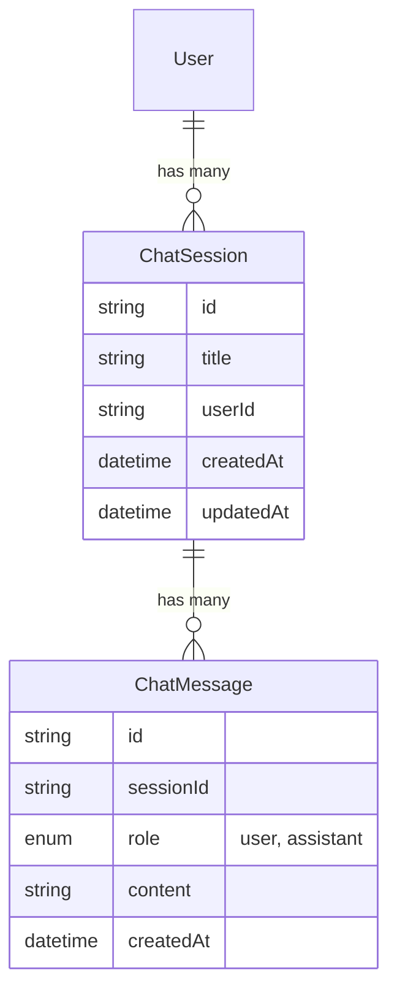

# Chat Memory & Persistence Architecture

## Overview
This document outlines the architecture for the "Mission Control Memory" system. The goal is to persist user-AI interactions to allow for context-aware refinements and historical lookups.

## Data Model

## Data Flow

1.  **Session Creation**:
    - User clicks "New Chat" or "New Campaign".
    - Client requests `POST /api/chat/sessions`.
    - Server creates `ChatSession` and returns ID.

2.  **Message Exchange**:
    - User sends message.
    - Client updates UI (optimistic).
    - Client sends payload to `/api/chat` including `sessionId`.
    - Server:
        1.  Saves User Message to `ChatMessage`.
        2.  Fetches previous context from `ChatMessage` (limit last 10-20).
        3.  Sends full context to Gemini.
        4.  Receives response.
        5.  Saves AI Message to `ChatMessage`.
        6.  Returns response to Client.

3.  **Context Refinement**:
    - User says: "Make the email more professional."
    - Because the Server fetches the *previous context* (which includes the Draft Email generated in the last turn), the AI understands what to "make professional".

## Context Strategy
To avoid token limits while maintaining context:
- **Rolling Window**: We send the last 20 messages for active context.
- **Summarization (Future)**: For very long sessions, we can periodically generate a summary and inject it as a system message.
